<p align="center">
  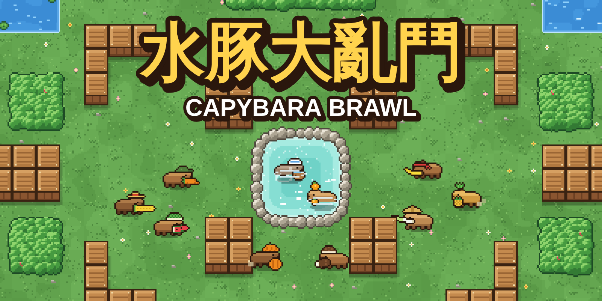
</p>

<p align="center">
  <b>10 隻拿著蔬菜水果當武器的水豚，在像素風競技場裡 3 對 3 大亂鬥！</b><br>
  手機、電腦打開瀏覽器就能玩：自己和電腦水豚打，或連上同一個 Wi-Fi 和朋友連線對戰。<br>
  👉 <a href="https://tinggeorge.github.io/capybara-brawl-game/"><b>用手機立刻開玩</b></a>（可以安裝成 App，沒有網路也能玩）
</p>

<p align="center">
  <a href="https://github.com/TingGeorge/capybara-brawl-game/actions/workflows/test.yml"></a>
  
  
  
  
  
  
</p>

---

## 🎮 這是什麼遊戲？

一款像《荒野亂鬥》那樣的**俯視角團隊對戰**網頁遊戲，畫面是《元氣騎士》風格的 2D 像素風。

所有角色都是水豚：有的扛著**胡蘿蔔槍**、有的把**橘子**當手榴彈丟、有的拿**香蕉**當刀砍……
分成藍隊和紅隊，先拿到 15 次擊倒的隊伍獲勝！

<p align="center">
  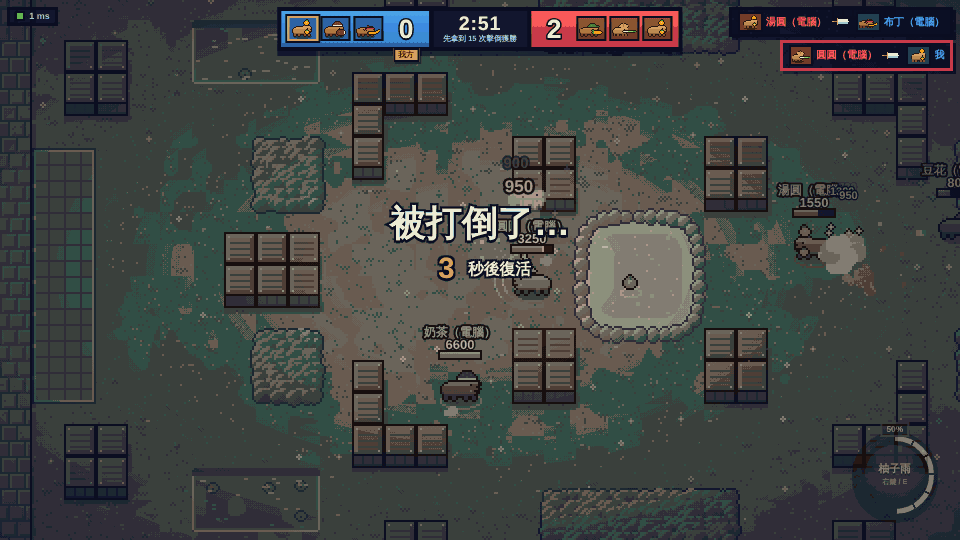
</p>

- 🐹 **10 隻角色、3 種定位**：射手、近戰、坦克，每隻都有自己的普通攻擊和大招
- 📱 **手機也能玩**：像《荒野亂鬥》一樣的觸控搖桿，左手移動、右手拖曳瞄準攻擊
- 📲 **可以安裝成 App（PWA）**：加到手機主畫面，全螢幕、沒有網路也能和電腦打
- 🌐 **區域網路連線**：一個人開伺服器，朋友用手機或電腦的瀏覽器打開網址就能加入，最多 6 個真人
- 🤖 **電腦水豚補位**：人不夠也能玩，一個人也可以打 3 對 3（單人對戰完全在瀏覽器裡跑，不需要伺服器）
- 🌿 **地圖機關**：躲進草叢、泡溫泉回血、在水裡游得更快
- 🎨 **全部即時畫出來**：遊戲裡的像素圖和音效都是程式即時產生的（只有 App 圖示是圖檔）

---

## 🐹 角色介紹

| | 角色 | 普通攻擊 | 大招 |
|:-:|---|---|---|
| 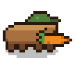 | **蘿蔔丁**<br>🎯 射手 | 🥕 **胡蘿蔔槍**：射出一根直直飛的胡蘿蔔 | **超級大蘿蔔**：巨大胡蘿蔔，貫穿路上所有敵人 |
| 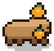 | **柚柚**<br>🎯 射手 | 🍊 **橘子手榴彈**：越過牆壁，落地爆炸 | **柚子雨**：一口氣丟出 5 顆橘子 |
| 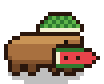 | **西瓜籽**<br>🎯 射手 | 🍉 **西瓜籽連發**：扇形噴出 3 顆西瓜籽 | **滾滾大西瓜**：穿過敵人、撞牆還會反彈 |
| 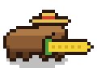 | **玉米**<br>🎯 射手 | 🌽 **玉米狙擊**：射程最遠、傷害最高 | **爆米花**：落地爆炸，再炸出一圈爆米花 |
| 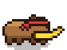 | **香蕉武士**<br>⚔️ 近戰 | 🍌 **香蕉刀**：往前揮出弧形斬擊 | **香蕉皮陷阱**：踩到的敵人滑倒暈眩 |
| 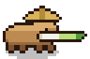 | **蔥劍客**<br>⚔️ 近戰 | 🥬 **青蔥長劍**：攻擊距離很長的突刺 | **青蔥旋風**：高速旋轉 3 秒，掃到誰打誰 |
| 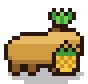 | **鳳梨拳王**<br>⚔️ 近戰 | 🍍 **鳳梨拳套**：全場最快的連續出拳 | **鳳梨衝刺**：往前猛衝，把敵人撞飛 |
| 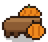 | **南瓜騎士**<br>🛡️ 坦克 | 🎃 **南瓜盾**：大範圍盾擊，把敵人推開 | **南瓜堡壘**：4 秒內受到的傷害減少 60% |
|  | **椰子大力士**<br>🛡️ 坦克 | 🥥 **椰殼霰彈**：近距離噴出 5 片碎片 | **椰子大跳躍**：跳過去砸地、震開敵人 |
| 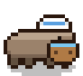 | **泡湯長老**<br>🛡️ 坦克 | ♨️ **溫泉木桶**：扇形潑出熱水 | **露天溫泉**：隊友泡著回血，敵人會被燙到 |

> 🎯 **射手**血少、射程長　⚔️ **近戰**血多、跑得快　🛡️ **坦克**血最多、走得慢

---

## 🚀 怎麼開始玩

### 📱 用手機自己玩（什麼都不用裝）

1. 用手機打開 **https://tinggeorge.github.io/capybara-brawl-game/**
2. 輸入名字 → 按 **開始對戰（和電腦打）** → 選角色 → **開始對戰！**
3. 想要像 App 一樣從主畫面打開（全螢幕、沒網路也能玩）：
   - **iPhone / iPad（Safari）**：按下方的「分享」按鈕 → **加入主畫面**
   - **Android（Chrome）**：按右上角「⋮」 → **安裝應用程式**（或「加到主畫面」）

> 手機橫著拿畫面最大。這個網址只能和電腦水豚打；想和朋友連線對戰，請照下面的方式開伺服器。

### 🌐 和朋友連線對戰

#### 房主（只要一個人做）

1. 安裝 [Node.js](https://nodejs.org/)（18 版以上，選 LTS 就好）
2. 下載這個專案：按右上角綠色的 **Code → Download ZIP** 解壓縮，或是
   ```bash
   git clone https://github.com/TingGeorge/capybara-brawl-game.git
   ```
3. 在專案資料夾裡打開終端機，輸入：
   ```bash
   npm start
   ```
   不需要 `npm install`，這個遊戲沒有用任何第三方套件。
4. 畫面會顯示兩個網址：
   ```
   🐹 水豚大亂鬥伺服器開好了！
     你自己玩：      http://localhost:3000
     朋友（同一個 Wi-Fi）打開：
                     http://192.168.1.23:3000
   ```
   自己用瀏覽器打開 `http://localhost:3000`，把第二個網址傳給朋友。

#### 朋友

**什麼都不用下載！** 連上和房主**同一個 Wi-Fi**，用手機或電腦的瀏覽器打開房主給的網址就好。

#### 開打

輸入名字 → 按 **連線對戰** → 選角色、選隊伍 → 房主按下 **開始對戰！**
（按 **單人對戰** 則是自己在瀏覽器裡和電腦打，不會進到大家的大廳。）
人數不夠的話，房主勾選「用電腦水豚補滿 3 對 3」，電腦會自動補位。

<p align="center">
  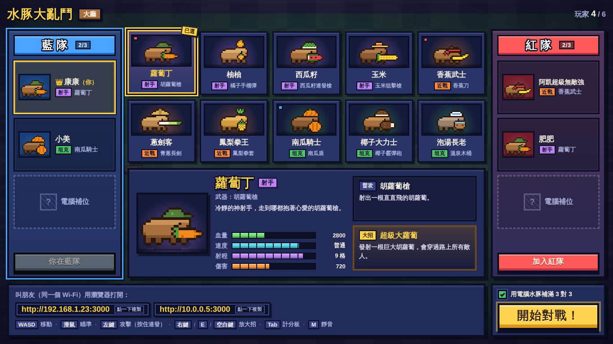
</p>

---

## 🎮 操作方式

### 📱 手機（觸控）

| 手指 | 動作 |
|---|---|
| 螢幕**左半邊**按住拖曳 | 移動（手指按在哪裡，搖桿就出現在哪裡） |
| 右下 **攻擊鈕**：拖曳 → 放開 | 往拖曳的方向瞄準、放開就發射；拖曳的長度決定橘子這類拋物線攻擊丟多遠 |
| 右下 **攻擊鈕**：點一下 | 自動瞄準最近的敵人 |
| **大招鈕**（集滿會發光） | 用法和攻擊鈕一樣：拖曳瞄準、放開發射，點一下自動瞄準 |
| 瞄準時拖回按鈕中間再放開 | 取消這一發 |
| 左上 **計分板** / **靜音** / **離開** | 看計分板、開關聲音、離開單人對戰（按兩次才會離開） |

### ⌨️ 電腦（鍵盤滑鼠）

| 按鍵 | 動作 |
|---|---|
| `W` `A` `S` `D` / 方向鍵 | 移動 |
| 滑鼠 | 瞄準 |
| 左鍵 | 普通攻擊（按住可以連發） |
| 右鍵（按住瞄準、放開發射）/ `E` / 空白鍵 | 放大招 |
| `Tab` | 看計分板 |
| `M` | 靜音 / 開聲音 |

## 📜 玩法規則

- **團隊擊倒賽**：先拿到 **15 次擊倒**的隊伍獲勝；3 分鐘到了就比擊倒數。
- **彈藥**：每次攻擊用掉一格（最多 3 格），會自動裝填。
- **大招**：普通攻擊打中敵人會集氣，集滿後右下角按鈕會發光，就可以放大招。
- **回血**：3 秒沒攻擊也沒被打，就會開始自動回血。
- **復活**：被打倒 3 秒後在自己的出生點復活，復活後有短暫無敵。

| 地圖上的東西 | 效果 |
|---|---|
| 🌿 草叢 | 躲進去敵人就看不到你（攻擊或被打中會暴露，敵人靠很近也看得到） |
| ♨️ 中央溫泉 | 站在裡面會持續回血，大家都想搶 |
| 💧 水池 | 水豚很會游泳，在水裡跑得比較快 |
| 📦 木箱 | 擋住子彈，但橘子手榴彈這類拋物線攻擊可以丟過去 |

<p align="center">
  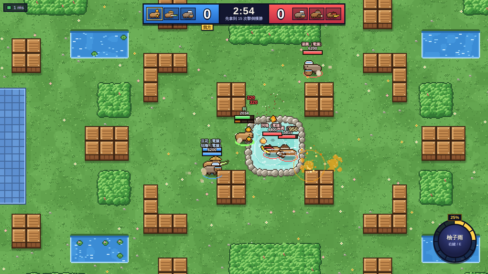
  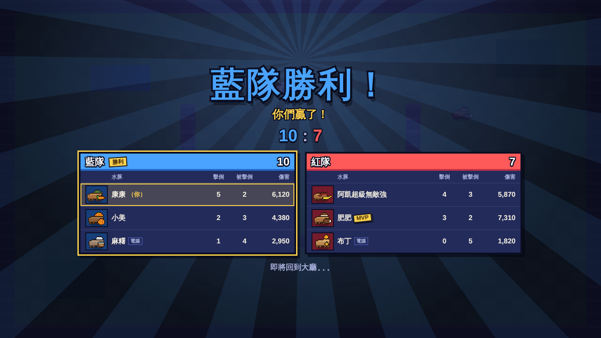
</p>

---

<details>
<summary><b>📲 為什麼用房主的網址不能「安裝成 App」？</b></summary>

瀏覽器規定只有 `https://` 的網站（或 `localhost`）才能安裝成 App、離線使用。
房主電腦給的 `http://192.168.x.x:3000` 是區域網路的 `http` 網址，所以手機打開後一樣可以用觸控玩、可以連線對戰，只是不能安裝。
想安裝到主畫面，請用上面的 GitHub Pages 網址（那個版本只有單人對戰）。

</details>

<details>
<summary><b>🔧 朋友連不進來？</b></summary>

1. **防火牆**：第一次執行 `npm start` 時，Windows 會問「是否允許 Node.js 存取網路」，請勾「私人網路」並按「允許」；Mac 跳出「是否允許傳入連線」也按「允許」。之前按了拒絕的話，到「Windows 安全性 → 防火牆與網路保護 → 允許應用程式通過防火牆」把 Node.js 打勾。
2. **確認是同一個 Wi-Fi**：很多公共 Wi-Fi（學校、咖啡廳）會擋裝置之間的連線，這時用其中一個人的**手機熱點**，大家都連那個熱點就可以了。
3. **網址要打對**：要用房主電腦顯示的 `http://192.168.x.x:3000`，開頭是 `http://` 不是 `https://`。
4. **3000 埠號被佔用**：換一個埠號，例如 `PORT=3001 npm start`（Windows PowerShell：`$env:PORT=3001; npm start`），朋友的網址也要改成 `:3001`。

</details>

<details>
<summary><b>🧩 給想改程式的人</b></summary>

- **伺服器說了算**：移動、傷害、擊倒都在房主電腦上計算（每秒 60 次），每秒送 30 次畫面狀態給大家。
- **單人對戰不用伺服器**：同一份大廳和對戰程式（`shared/lobby.js`、`shared/match.js`）直接在瀏覽器裡跑（`public/js/local-net.js`），所以可以放在 GitHub Pages、也能離線玩。
- **不延遲的手感**：自己的水豚會先在瀏覽器裡移動，收到伺服器結果再校正；其他人則在兩個畫面狀態之間插值，看起來很滑順。
- **零套件**：伺服器只用 Node.js 內建模組（包含自己寫的簡易 WebSocket）；像素圖用 Canvas 即時畫出來，音效用 Web Audio 即時合成。
- **調整平衡**：所有角色的血量、速度、傷害、射程都在 [`shared/characters.js`](shared/characters.js)。

```
server/    網頁伺服器、WebSocket、遊戲迴圈
shared/    伺服器和瀏覽器共用：大廳、對戰模擬、電腦 AI、常數、地圖、角色數值、碰撞
public/    網頁：畫面繪製、像素圖、介面、音效、連線、觸控按鈕、PWA（manifest、service worker、圖示）
scripts/   build-static.mjs：整理成 GitHub Pages 用的純靜態網站
test/      npm test：遊戲規則、電腦對戰、連線、單人模式、PWA 檔案
e2e/      npm run test:e2e：瀏覽器實玩測試（包含手機觸控、靜態網站、離線）
```

**放到 GitHub Pages（手機安裝用的網址）**：推送到 `main` 分支時，
[`.github/workflows/pages.yml`](.github/workflows/pages.yml) 會用 `node scripts/build-static.mjs` 整理出只有單人模式的靜態網站並自動部署。
第一次要到 GitHub 專案的 **Settings → Pages → Build and deployment → Source** 選 **GitHub Actions**。

想打短一點或長一點的比賽，可以在啟動時設定（秒數、擊倒數）：

```bash
MATCH_SECONDS=120 KO_TARGET=10 npm start
```

測試：

```bash
npm test          # 遊戲規則、每隻角色的大招、電腦對戰、連線、伺服器啟動
npm run test:e2e  # 真的開瀏覽器連線玩（先執行 npm install --no-save playwright 和 npx playwright install chromium）
```

每次推送程式，[GitHub Actions](https://github.com/TingGeorge/capybara-brawl-game/actions) 都會自動在 Windows、macOS、Linux 上跑 `npm test`，
並用 Chrome、Firefox、Safari（WebKit）實際連線玩一輪：兩人對戰、網路延遲時的移動、中途加入觀戰、滿房、斷線提示，
還有用手指玩單人對戰、手機直拿的版面、GitHub Pages 版本和離線開啟。

伺服器開著的時候，還有幾個開發用的預覽頁：
`/dev/sprites.html`（所有像素圖和整張地圖）、`/dev/renderer-preview.html`（戰鬥畫面）、`/dev/ui-preview.html?screen=lobby-host`（各個介面）、
`/dev/icons.html`（App 圖示，可以重新產生 `public/icons/` 裡的 PNG）。

用電腦測試手機版：Chrome 開發者工具（F12）按「切換裝置」圖示選一支手機，觸控按鈕就會出現（用滑鼠點一下畫面會切回電腦操作，再用模擬的手指點一下就會切回來）。

</details>
